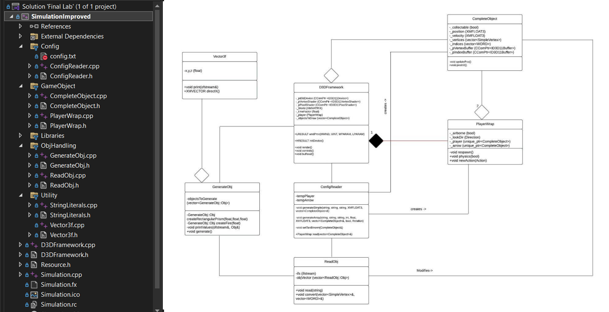

# Codebase structure
This project is implemented primarily in C++, with multiple classes separated into header and .cpp files. This exhibits much better object oriented design than previous projects, which is further improved upon by my second trimester project, the networked antigravity chamber.
 

