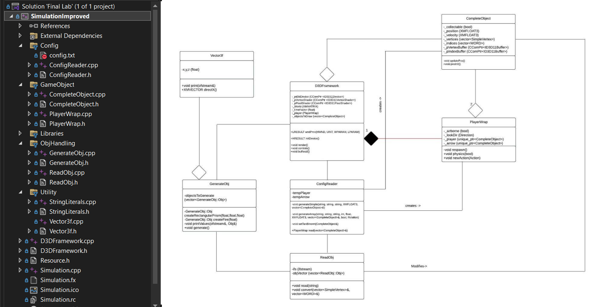

# Codebase structure
This project is implemented primarily in C++, with multiple classes separated into header and .cpp files. This exhibits much better object oriented design than previous projects, which is further improved upon by my second trimester project, the networked antigravity chamber.
 


# Game objects
An in game object is represented as a DirectX11 3D vertex and index buffer, a position and velocity, and some minor tags.
```C++
class CompleteObject final{
	bool _collected;
	bool _collectable;
	Rotation _rotation;
	XMFLOAT3 _position;
	XMFLOAT3 _velocity;
	//type is specified in config.txt and used to determine vertex shaders, rasterizers, etc
	std::string _type;
	std::vector<SimpleVertex> _vertices;
	std::vector<WORD> _indices;
	int _indexCount;
	CComPtr <ID3D11Buffer> _pVertexBuffer;
	CComPtr <ID3D11Buffer> _pIndexBuffer;
	XMFLOAT3 _spawnPoint;
	//...
}
```

# Physics
The game only has very basic physics, and really only for the player object. If the player is above solid ground, they don't fall, and if they aren't, they do fall. Other movement for a given frame is set based on buttons that are pressed on that frame.
```C++
void PlayerWrap::physics(bool abovePlatform) {
	//grounded
	if (abovePlatform && -0.01 < _velocity.y && 0.01 > _velocity.y && _position.y <= _player->getSpawn().y - 5.0f) {}
	//landing
	else if (abovePlatform && _position.y <= _player->getSpawn().y &&
		     _velocity.y < 0 && 
		     _position.y >= _player->getSpawn().y - 10.0f) {
		_airborne = false;
		_player->ground();
		_arrow->ground();
		_position.y = _player->getPos().y;
		_velocity.y = 0;
	}
	//accelerating down
	else if (_position.y >= _player->getSpawn().y - 100.0f) {
		_velocity.y -= 0.0012f * _timeFactor;
	}
	//restart
	else {
		respawn();
	}

	updatePos();
}
```

# Mesh creation
Vertex and index lists for each object are created from scratch and encoded into .obj format. </br>
Example of a rectangular prism:
```C++
GenerateObj::Obj GenerateObj::createRectangularPrism(float width, float height, float depth) const {
	Obj tempObj;
	Vector3f vertices[8];
	vertices[0] = Vector3f(-width/2, height/2, -depth/2);
	vertices[1] = Vector3f(width/2, height/2, -depth/2);
	vertices[2] = Vector3f(width/2, height/2, depth/2);
	vertices[3] = Vector3f(-width/2, height/2, depth/2);
	vertices[4] = Vector3f(-width/2, -height/2, -depth/2);
	vertices[5] = Vector3f(width/2, -height/2, -depth/2);
	vertices[6] = Vector3f(width/2, -height/2, depth/2);
	vertices[7] = Vector3f(-width/2, -height/2, depth/2);
	for (const auto& i : vertices) {
		tempObj.myVertices.push_back(i);
	}
	Texture textures[4];
	textures[0] = Texture(0, 1);
	textures[1] = Texture(1, 1);
	textures[2] = Texture(1, 0);
	textures[3] = Texture(0, 0);
	for (const auto& i : textures) {
		tempObj.myTextures.push_back(i);
	}

	Vector3f normals[6];
	normals[0] = Vector3f(0, 1, 0);
	normals[1] = Vector3f(0, 0, -1);
	normals[2] = Vector3f(1, 0, 0);
	normals[3] = Vector3f(0, 0, 1);
	normals[4] = Vector3f(0, -1, 0);
	normals[5] = Vector3f(0, -1, 0);
	for (const auto& i : normals) {
		tempObj.myNormals.push_back(i);
	}

	Face faces[6];

	info infos[24] = {
		{0,1,1,1},
		{0,2,2,1},
		{0,3,3,1},
		{0,4,4,1},
		{1,1,1,2},
		{1,5,2,2},
		{1,6,3,2},
		{1,2,4,2},
		{2,2,1,3},
		{2,6,2,3},
		{2,7,3,3},
		{2,3,4,3},
		{3,3,1,4},
		{3,7,2,4},
		{3,8,3,4},
		{3,4,4,4},
		{4,4,1,5},
		{4,8,2,5},
		{4,5,3,5},
		{4,1,4,5},
		{5,8,1,6},
		{5,7,2,6},
		{5,6,3,6},
		{5,5,4,6}
	};

	for (auto i = 0; i < 24; i++) {
		addFaceData(faces[infos[i].face], infos[i].vertex, infos[i].texture, infos[i].normal);
	}

	for (const auto& i : faces) {
		tempObj.myFaces.push_back(i);
	}
	return tempObj;
}
```
The more complicated shapes are created either algorithmically, by combining simpler shapes, or both. </br>
Partial implementation of a sphere:
```C++
GenerateObj::Obj GenerateObj::createSphere(float radius, int tesselation) const{
	Obj tempObj;
	const auto PI = 3.14159265359897f;
	const auto STACKCOUNT = tesselation;
	const auto SLICECOUNT = tesselation;
	const float PHISTEP = PI / STACKCOUNT;
	const float THETASTEP = (2.0f * PI) / SLICECOUNT;

	//top vertex
	tempObj.myVertices.push_back(Vector3f(0.0f, radius, 0.0f));
	tempObj.myNormals.push_back(Vector3f(0, 1, 0));

	//no texture
	tempObj.myTextures.push_back(Texture(-1,-1));

	for (auto i = 1; i < STACKCOUNT; i++) {
		const float phi = i * PHISTEP;
		for (auto j = 0; j < SLICECOUNT; j++) {
			const float theta = j * THETASTEP;

			tempObj.myVertices.push_back(Vector3f(radius * sinf(phi) * cosf(theta), radius * cosf(phi), radius * sinf(phi)*sinf(theta)));
			XMVECTOR tempNormal = tempObj.myVertices.back().directX();
			tempNormal = XMVector3Normalize(tempNormal);
			tempObj.myNormals.push_back(Vector3f(tempNormal));
		}
	}
	// ...
}
```
The .obj files are then parsed and turned into game objects. This is unnecessarily inefficient, but it was an academic excercise required by the project.
```C++
while (std::getline(ifs,line)) {
	std::istringstream iss(line);
	iss >> word;
	
	if (word[0] == '#') {
		continue;
	}
	else if (word == "o") {
		if (currentObj != nullptr) {
			iss >> word;
			objVector.push_back(*currentObj);
			currentObj.reset();
			currentObj = std::make_unique<Obj>();
		}
		else {
			currentObj = std::make_unique<Obj>();
		}
	}
	else if (word == "v") {
		XMFLOAT3 tempVertex;
		iss >> tempVertex.x;
		iss >> tempVertex.y;
		iss >> tempVertex.z;
		currentObj->vertexPos.push_back(tempVertex);
		continue;
	}
	else if (word == "vt") {
		XMFLOAT2 tempVertex;
		iss >> tempVertex.x;
		iss >> tempVertex.y;
		currentObj->vertexTex.push_back(tempVertex);
		continue;
	}
	else if (word == "vn") {
		XMFLOAT3 tempVertex;
		iss >> tempVertex.x;
		iss >> tempVertex.y;
		iss >> tempVertex.z;
		currentObj->vertexNorm.push_back(tempVertex);
	}
	else if (word == "f") {
		Face tempFace;
		Face::faceData tempData;
		char throwaway;
		while (iss >> word) {
			std::istringstream vertexStream(word);
			//vertex /
			vertexStream >> tempData.vertex >> throwaway;
			//if vertex/texture
			if (vertexStream.peek() != '/') {
				vertexStream >> tempData.texture >> throwaway;
			}
			//if vertex//
			else {
				vertexStream.ignore();
			}
			vertexStream >> tempData.normal;
			tempFace.myData.push_back(tempData);
		}
		currentObj->faceVector.push_back(tempFace);
	}
	else {
		continue;
	}
}
objVector.push_back(*currentObj);
```
# DirectX rendering
The setup of the DirectX11 environment was provided at the start of the assignment, but the render loop was not. 
```C++
void D3DFramework::render() {
	auto frameStartTime = std::chrono::high_resolution_clock::now();
	//imgui start of loop
	ImGui_ImplDX11_NewFrame();
	ImGui_ImplWin32_NewFrame();
	ImGui::NewFrame();

	//user inputs
	controls();
	physics();

	//camera tracks character
	const XMFLOAT3 rawPos = _player.getPos();
	const XMVECTOR Eye = XMVectorSet(rawPos.x, rawPos.y + 0.0f, rawPos.z + _currentDistance, 1.0f);
	const XMVECTOR At = XMVectorSet(rawPos.x, rawPos.y + 0.0f, rawPos.z, 0.0f);
	const XMVECTOR Up = XMVectorSet(0.0f, 1.0f, 0.0f, 0.0f);
	_View = XMMatrixLookAtLH(Eye, At, Up);
	const XMVECTOR lightPos = XMVectorSet(30000, 20000, 100000, 1);

	//time
	static float t = 0.0f;
	if (_driverType == D3D_DRIVER_TYPE_REFERENCE)
	{
		t += static_cast<float>(XM_PI) * 0.0125f;
	}
	else
	{
		static ULONGLONG timeStart = 0;
		const ULONGLONG timeCur = GetTickCount64();
		if (timeStart == 0)
			timeStart = timeCur;
		t = (timeCur - timeStart) / 1000.0f;
	}

	//Rotate various objects
	_rotation += 0.001f;

	//
	// Clear the back buffer
	//
	_pImmediateContext->ClearRenderTargetView(_pRenderTargetView, Colors::MidnightBlue);

	//set depth testing
	_pImmediateContext->ClearDepthStencilView(_pDepthStencilView, D3D11_CLEAR_DEPTH, 1.0f, 0);
	_pImmediateContext->OMSetRenderTargets(1, &_pRenderTargetView.p, _pDepthStencilView);

	//draw objects
	{
		drawSingle(lightPos, Eye, t, _player.getPlayer());
		drawSingle(lightPos, Eye, t, _player.getArrow());
	}
	for (const auto& object : _objectsToDraw) {
		if (!object.isCollected())
		drawSingle(lightPos, Eye, t, object);
	}

	//imGUI stuff
	guiFrame();
	//imgui end of loop
	ImGui::Render();
	ImGui_ImplDX11_RenderDrawData(ImGui::GetDrawData());

	//
	// Present our back buffer to our front buffer
	//
	_swapChain->Present(0, 0);

	// Measure the end time of the frame
	auto frameEndTime = std::chrono::high_resolution_clock::now();
	const auto frameDuration = std::chrono::duration_cast<std::chrono::milliseconds>(frameEndTime - frameStartTime);

	// Sleep for the remaining time to maintain the target framerate
	if (frameDuration < TARGET_FRAME_DURATION) {
		std::this_thread::sleep_for(TARGET_FRAME_DURATION - frameDuration);
	}
}
```
# HLSL
The full .fx file is quite substantial, as this project uses many different vertex and pixel shaders. Here is the vertex and pixel shaders for phong shading.
```C++
//phong shading
struct VS_OUTPUT_PHONG
{
    float4 Pos : SV_POSITION;
    float3 Norm : TEXCOORD0;
    float3 PosWorld : TEXCOORD1;
    float4 lightPos : TEXCOORD2;
    float4 cameraPos : TEXCOORD3;
    float spotlight : TEXCOORD4;
};
VS_OUTPUT_PHONG VS_phong(float4 Pos : POSITION, float3 N : NORMAL)
{
    VS_OUTPUT_PHONG output = (VS_OUTPUT_PHONG) 0;
    output.Pos = mul(Pos, World);
    output.Pos = mul(output.Pos, View);
    output.Pos = mul(output.Pos, Projection);

    output.PosWorld = mul(Pos, World).xyz;
    output.Norm = mul(normalize(N), trunc(World)).xyz;
    output.lightPos = lightPos;
    output.cameraPos = cameraPos;
    output.spotlight = spotlightCB;
    return output;
}
float4 PS_phong(VS_OUTPUT_PHONG input) : SV_Target
{
    float4 finalColor = calculateLighting(input.spotlight, input.Norm, input.lightPos.xyz, float4(input.PosWorld, 1), input.PosWorld, input.cameraPos, false);
    return finalColor;
}
```

# Review
This code base definitely could use some improvements, particularly in object oriented design and framerate implementation, but it is a significant improvement over earlier projects.